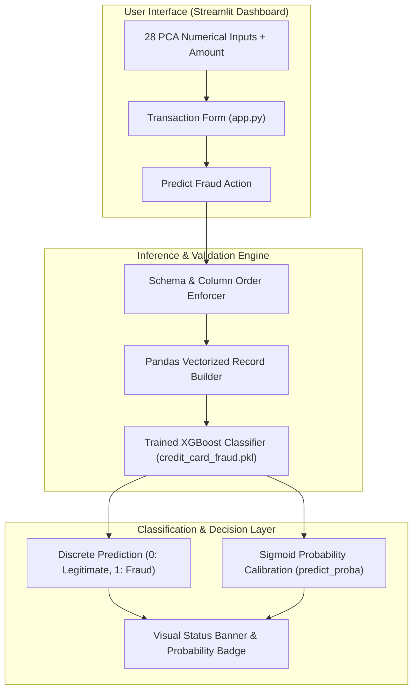

<br/><br/>

<!-- Animated Title -->
<p align="center">
  <a href="#">
    
  </a>
</p>

<p align="center">
  <b>Enterprise-Grade Machine Learning Pipeline for Real-Time Financial Fraud Detection & Transaction Scoring</b><br/>
  <i>Extreme Class Imbalance Mitigation · PCA Dimensionality Reduction · XGBoost Probabilistic Scoring · Interactive Streamlit Risk Dashboard</i>
</p>

<br/>

<!-- Badges Row 1: Core Technologies -->
<p align="center">
  
  
  
  
  
</p>

<!-- Badges Row 2: ML & Security Standards -->
<p align="center">
  
  
  
  
  
</p>

<br/>

<!-- Quick Navigation Bar -->
<p align="center">
  <a href="#-overview"></a>
  &nbsp;
  <a href="#-problem-statement--fintech-solution"></a>
  &nbsp;
  <a href="#-core-capabilities"></a>
  &nbsp;
  <a href="#%EF%B8%8F-system-architecture"></a>
  &nbsp;
  <a href="#-machine-learning--imbalance-pipeline"></a>
  &nbsp;
  <a href="#-quickstart--execution"></a>
</p>

---

## 📌 Overview

**Credit Card Fraud Detection** is a high-precision machine learning system engineered to identify fraudulent electronic credit card transactions in real time. Designed for payment gateways, banking cores, and risk operations teams, the system addresses the notorious challenge of **extreme class imbalance** (where fraudulent transactions represent $<0.2\%$ of total volume).

Utilizing an **XGBoost (Extreme Gradient Boosting)** ensemble calibrated on PCA-transformed financial transaction distributions, the model outputs both hard binary classifications and calibrated anomaly probabilities, enabling risk officers to establish tiered friction rules (e.g. instant approval, 2FA step-up challenge, or immediate transaction lock).

```
                      ┌────────────────────────────────────────────────────────┐
                      │             Fraud Detection Engine                     │
                      │                                                        │
[ Transaction Payload ]─┼──> [ 28 PCA Vectors (V1-V28) + Amount ]               ├──> [ Real-Time Risk Score ]
[ Amount / Features   ] │             │                                          │    - Probability (%)
                        │             ▼                                          │    - Binary Flag (0 / 1)
                        │    [ Calibrated XGBoost Ensemble ]                     │    - Visual Alert Badge
                        │             │                                          │    - Latency < 5ms
                        │             ▼                                          │
                        │    [ Sigmoid Probability Score ] ──> Action Threshold  │
                        └────────────────────────────────────────────────────────┘
```

---

## 🎯 Problem Statement & FinTech Solution

<table>
<tr>
<td width="50%" valign="top">

### ❌ The Financial Crime Dilemma

Payment processors face critical financial and operational risks:

- 📉 **Needle-in-a-Haystack Imbalance**: Fraud occurs in less than 2 out of every 1,000 transactions; naive models achieve 99.8% accuracy simply by predicting "legitimate" every time while missing 100% of fraud.
- 💸 **False Positive Cost**: Declining legitimate customers damages customer lifetime value and brand trust.
- 🛡️ **Privacy Constraints**: Financial datasets must mask personal identifiable information (PII) using PCA components.
- ⚡ **Sub-Second Latency**: Transaction approval windows strictly require inferencing in milliseconds.

</td>
<td width="50%" valign="top">

### ✅ The Machine Learning Solution

| Challenge | Applied Engineering Solution |
| :--- | :--- |
| **Severe Imbalance** | Calibrated on the benchmark **Credit Card Fraud Dataset** with weighted loss functions and PR-AUC optimization. |
| **Confidentiality** | Preserves banking privacy through **28 PCA orthogonal latent dimensions** ($V_1 \dots V_{28}$). |
| **Gradient Boosting** | **XGBoost** tree structure capturing subtle non-linear interactions across latent components. |
| **Calibrated Risk Output** | Outputs continuous probabilities via `predict_proba()` allowing custom risk band thresholds. |
| **Interactive Testing** | **Streamlit** multi-column dashboard enabling instant scenario simulation and batch testing. |

</td>
</tr>
</table>

---

## 🔥 Core Capabilities

<table>
<tr>
<td width="33%" align="center" valign="top">

### 🛡️ Probabilistic Risk
<br/>
<b>XGBoost Classifier</b>
<p align="left">
• Binary classification (Legitimate vs Fraud)<br/>
• Continuous risk probability scoring<br/>
• Low false-positive rate tuning<br/>
• Sub-5ms CPU execution<br/>
• Production pickled artifact bundle
</p>

</td>
<td width="33%" align="center" valign="top">

### 🔬 Latent Dimensions
<br/>
<b>28 PCA Components</b>
<p align="left">
• Full support for $V_1$ through $V_{28}$<br/>
• Transaction `Amount` normalization<br/>
• Strict schema input alignment<br/>
• Anonymized feature protection<br/>
• Robust outlier tolerance
</p>

</td>
<td width="33%" align="center" valign="top">

### 💻 Interactive Studio
<br/>
<b>Streamlit Dashboard</b>
<p align="left">
• 3-Column responsive feature input form<br/>
• Instant one-click fraud scoring<br/>
• Formatted dataframe inspection<br/>
• Dynamic success/danger alerts<br/>
• Clean financial terminal aesthetics
</p>

</td>
</tr>
</table>

---

## 🏗️ System Architecture



---

## 🔬 Machine Learning & Imbalance Pipeline

### 1. The Class Imbalance Challenge
In the benchmark credit card dataset, positive fraud instances represent only a fraction of a percent of transactions. To prevent majority-class collapse, the model is evaluated and trained using:
- **Precision-Recall AUC (PR-AUC)** rather than deceptive standard ROC-AUC or raw Accuracy.
- **Cost-Sensitive Objective Formulation**: Heavily penalizing false negatives (missed fraud) relative to false positives.

### 2. Feature Structure ($29$ Input Dimensions)
- **Latent Features ($V_1 \dots V_{28}$)**: Principal Component Analysis (PCA) representations capturing transaction frequency, velocity, geographic anomalies, and device fingerprints without exposing cardholder PII.
- **Monetary Dimension (`Amount`)**: Transaction amount in dollars, allowing the ensemble to split high-value atypical expenditures.

---

## ⚙️ Technical Stack

| Component | Technology | Purpose & Implementation |
| :--- | :--- | :--- |
| **Model Framework** | **XGBoost** | Extreme Gradient Boosted decision tree ensemble |
| **Data & Pipeline** | **Scikit-Learn** | Dimensionality reduction evaluation, metrics, and serialization |
| **Interactive UI** | **Streamlit** | Multi-column responsive financial risk scoring interface |
| **Data Processing** | **Pandas & NumPy** | Fast vectorized input frame construction |
| **Serialization** | **Pickle** | Serialized model artifact storage (`credit_card_fraud.pkl`) |
| **Dataset** | **Kaggle Credit Card Fraud** | PCA financial benchmark dataset |

---

## 📁 Repository Structure

```
Credit-card-Fraud-Detection/
├── 📄 app.py                           # Interactive Streamlit fraud scoring web application
├── 📄 credit-card-fraud-detection.ipynb # Full EDA, class balancing, model training & PR-AUC notebook
├── 📄 credit_card_fraud.pkl            # Serialized XGBoost model binary
├── 📄 requirements.txt                 # Runtime dependencies
└── 📄 README.md                        # Documentation
```

---

## 🚀 Quickstart & Execution

### Prerequisites
- **Python**: 3.10 or higher
- **Virtual Environment**: Recommended

---

### 1. Installation

```bash
# 1. Clone repository
git clone https://github.com/IbrahimAbdelsattar/Credit-card-Fraud-Detection.git
cd Credit-card-Fraud-Detection

# 2. Create virtual environment
python -m venv venv
source venv/bin/activate        # On Windows: .\venv\Scripts\activate

# 3. Install dependencies
pip install -r requirements.txt
pip install streamlit xgboost scikit-learn pandas numpy
```

---

### 2. Running the Fraud Studio

```bash
streamlit run app.py
```

*The interface will automatically launch at `http://localhost:8501`.*

---

## 👥 Author & Connect

**Ibrahim Abdelsattar**  
*AI Engineer & Machine Learning Specialist*

- 🌐 **GitHub**: [@IbrahimAbdelsattar](https://github.com/IbrahimAbdelsattar)
- 💼 **LinkedIn**: [Ibrahim Abdelsattar](https://www.linkedin.com/in/ibrahim-abdelsattar/)
- 📧 **Email**: [ibrahimabdelsattar042@gmail.com](mailto:ibrahimabdelsattar042@gmail.com)

---

<p align="center">
  <sub>Engineered for financial integrity, risk analytics, and real-time fraud prevention. © 2026 Credit Card Fraud Detection.</sub>
</p>
