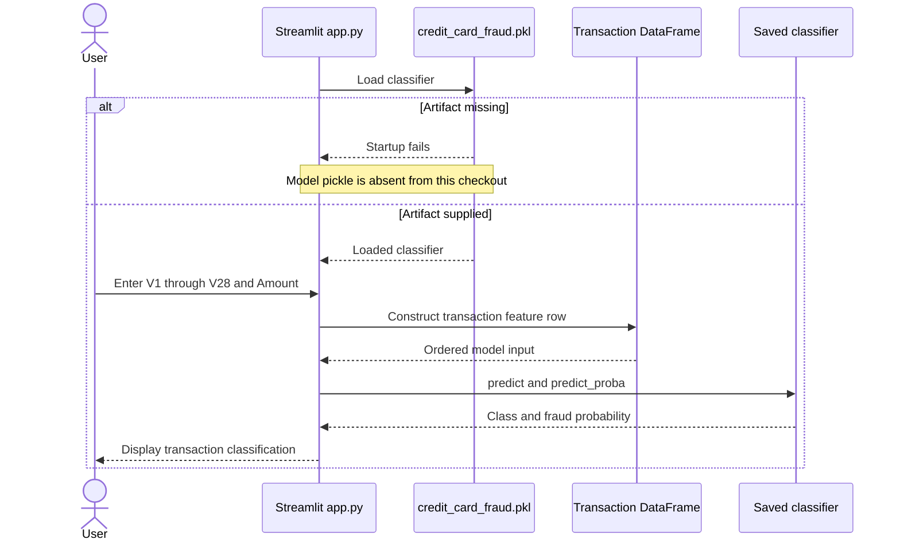

# Credit Card Fraud Detection

A notebook-based fraud classification project with a Streamlit interface for inspecting individual transactions.

**Technology:** Python · XGBoost · scikit-learn · pandas · Streamlit

## Features

- Enter the 28 provided transaction features (`V1`–`V28`) and `Amount`.
- Predict the legitimate/fraud class and display the model's class probability.
- Compare multiple classifiers and a dense neural network in the notebook.

## Repository guide

| Path | Purpose |
|---|---|
| [app.py](app.py) | Single-transaction prediction interface. |
| [credit-card-fraud-detection.ipynb](credit-card-fraud-detection.ipynb) | Exploration, classifier comparison, and neural experiments. |
| [requirements.txt](requirements.txt) | Inference dependencies. |

## Requirements and current limitations

`app.py` loads `credit_card_fraud.pkl`, which is absent from the current repository. Export the matching fitted XGBoost classifier before starting the app. The notebook references the 2023 credit-card dataset through Kaggle; that dataset is not committed here.

The deployed interface consumes existing `V1`–`V28` values; it does not transform raw cardholder data into these features. Preserve the training schema and preprocessing when creating the artifact. Notebook-only deep learning and Gradio dependencies are separate from the app requirements.

## UML diagrams

### Main workflow

This diagram shows the intended app inference path once the missing credit_card_fraud.pkl artifact is supplied.



## Getting started

```bash
git clone https://github.com/IbrahimAbdelsattar/Credit-card-Fraud-Detection.git
cd Credit-card-Fraud-Detection
```

Use a Python virtual environment:

```bash
python -m venv .venv
```

Activate it with `source .venv/bin/activate` on macOS/Linux or `.venv\Scripts\Activate.ps1` in PowerShell.

```bash
python -m pip install -r requirements.txt
python -m streamlit run app.py
```
